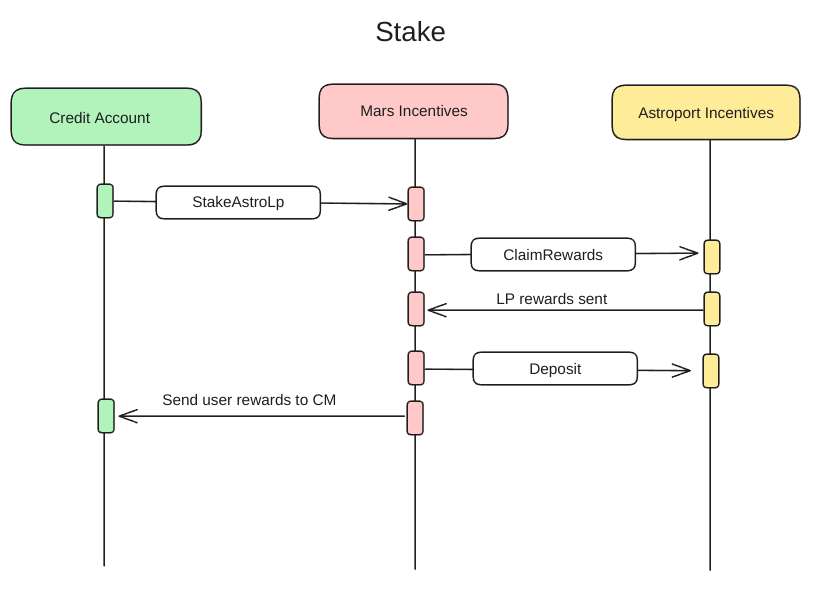
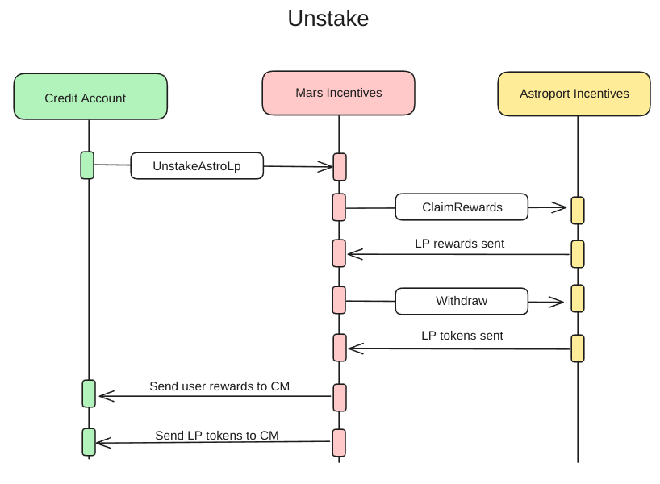
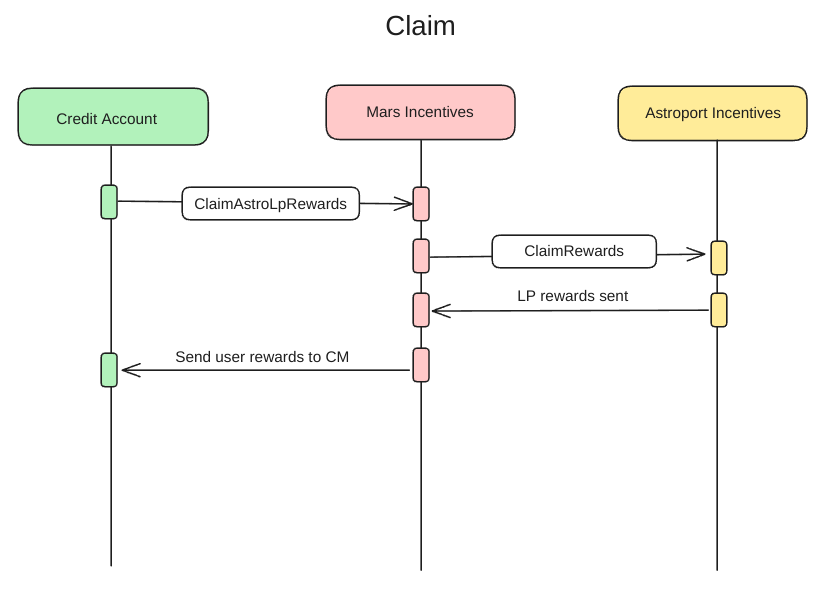

# Mars Incentives

A smart contract that manages both MARS incentives for redbank deposits, and Astroport LP incentives for staked LP positions

## Astroport 

Astroport requires users to 'stake' their Lp positions in the Astroport incentives
contract in order to accrue externally added incentives for that LP position.

Mars facilitates the ability for a credit account to stake into this contract via the Mars incentives contract, in order
to accrue these additional rewards whilst using that lp position as collateral in
that credit account.

The Mars Incentives contract pools all LP positions together in one staked position in Astroport, managing the accounting for each individual user internally.

Rewards are also pooled, and are distributed to the user based on their LP share amount since their last claim.
Because of this, we must claim rewards for a user each time they update their staked LP balance

This functionality is exposed through the stake, unstake, and claim actions via credit manager

### Stake

### Unstake

### Claim Rewards

## License

Contents of this crate are open source under [GNU General Public License v3](../../LICENSE) or later.
